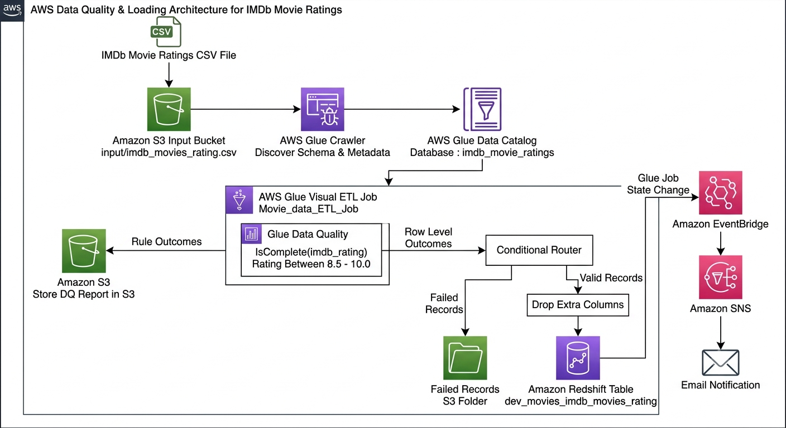
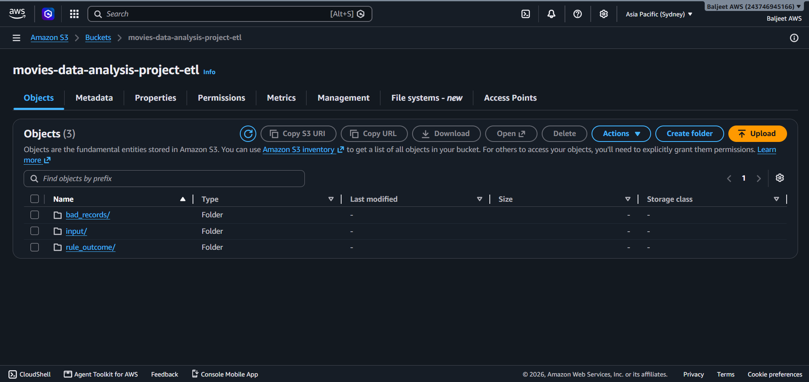
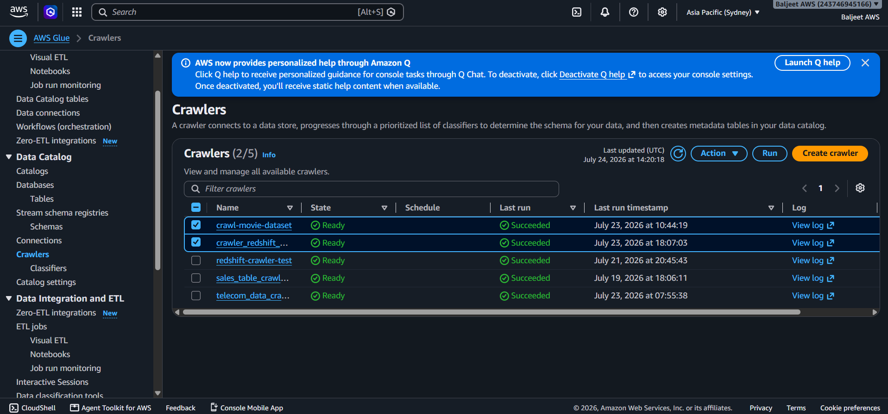
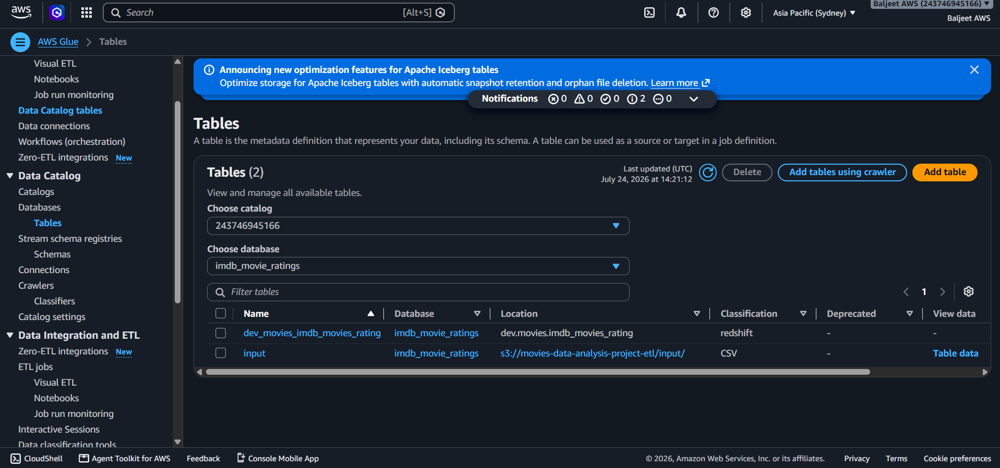
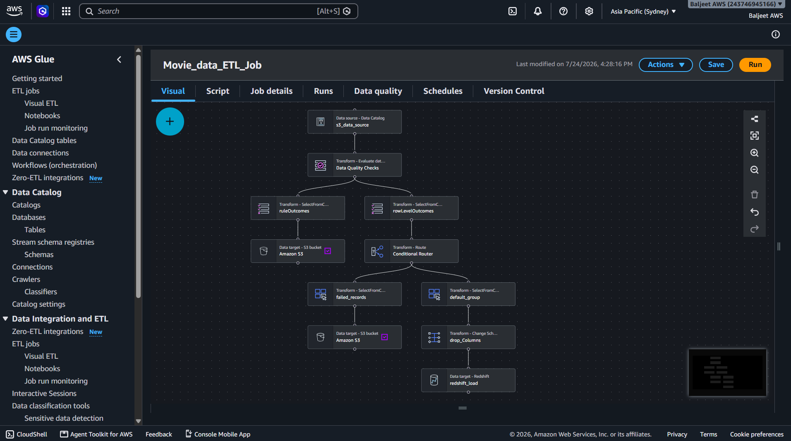
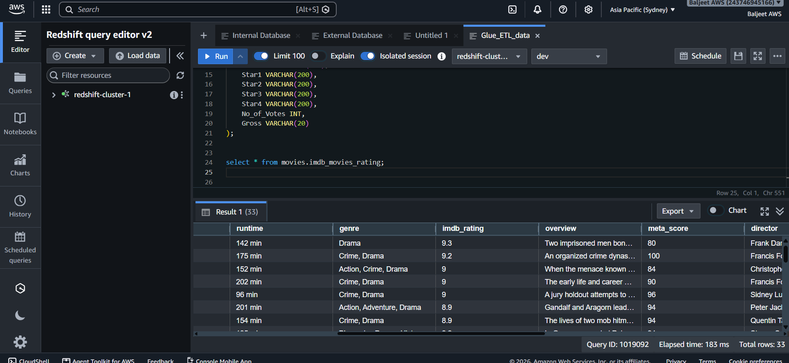
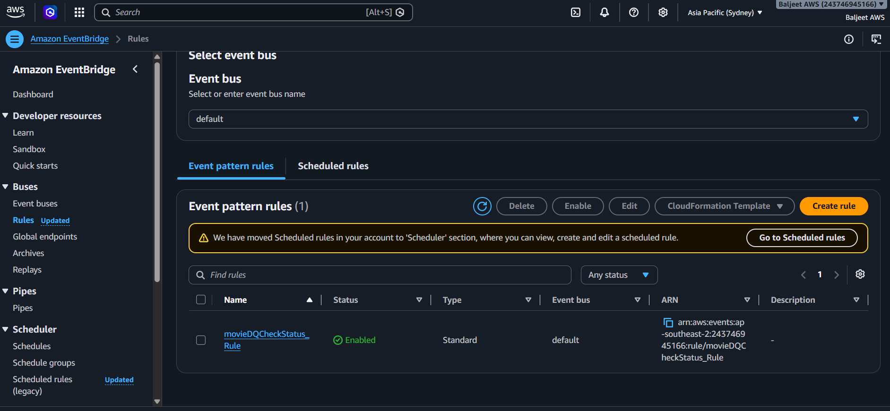
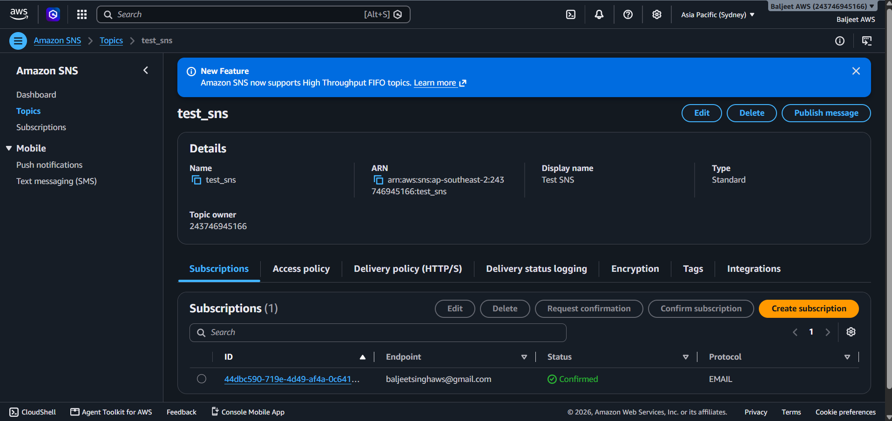

# 🎬 AWS Serverless ETL Pipeline for IMDb Movie Ratings


An end-to-end **serverless Data Engineering pipeline** built on AWS that automatically ingests IMDb movie ratings data, validates data quality, performs ETL transformations, loads clean records into Amazon Redshift, and generates email notifications for monitoring.

---

# 📑 Table of Contents

- [Project Overview](#-project-overview)
- [Architecture](#-architecture)
- [Project Workflow](#-project-workflow)
- [AWS Services Used](#-aws-services-used)
- [Data Quality Validation](#-data-quality-validation)
- [Repository Structure](#-repository-structure)
- [Screenshots](#-screenshots)
- [Learning Outcomes](#-learning-outcomes)
- [Future Improvements](#-future-improvements)

---

# 📖 Project Overview

This project demonstrates how to build a production-style ETL pipeline using fully managed AWS services.

The pipeline automatically:

- Reads IMDb movie ratings data from Amazon S3
- Discovers schema using AWS Glue Crawlers
- Stores metadata in AWS Glue Data Catalog
- Validates incoming data using AWS Glue Data Quality
- Routes valid and failed records using AWS Glue Visual ETL
- Loads validated data into Amazon Redshift
- Stores failed records for investigation
- Sends email notifications using Amazon EventBridge and Amazon SNS

The project demonstrates modern serverless ETL architecture with automated data validation and event-driven monitoring.

---

# 🏗 Architecture



---

# 🔄 Project Workflow

### Step 1 – Data Ingestion

The IMDb dataset is uploaded into an Amazon S3 bucket.

```
Amazon S3
        │
        ▼
Glue Crawler
```

---

### Step 2 – Schema Discovery

AWS Glue Crawler scans the dataset and automatically creates the metadata inside the Glue Data Catalog.

Database

```
imdb_movie_ratings
```

Input Table

```
input
```

---

### Step 3 – Visual ETL Processing

AWS Glue Visual ETL reads the Glue Catalog table and performs:

- Data Quality Validation
- Conditional Routing
- Column Transformations
- Data Loading

---

### Step 4 – Data Quality Validation

The ETL pipeline validates the dataset using AWS Glue Data Quality.

Rules applied:

```
IsComplete("imdb_rating")

ColumnValues("imdb_rating")
between 8.5 and 10.0
```

Records that fail validation are automatically separated from valid records.

---

### Step 5 – Conditional Routing

The Conditional Router splits the dataset into two paths.

✅ Valid Records

- Remove unnecessary columns
- Load into Amazon Redshift

❌ Failed Records

- Store in Amazon S3
- Preserve for investigation and possible reprocessing

---

### Step 6 – Data Warehouse

Only validated records are loaded into the destination Amazon Redshift table.

Destination Table

```
dev_movies_imdb_movies_rating
```

---

### Step 7 – Monitoring & Notifications

Glue Job events are monitored using Amazon EventBridge.

Whenever the configured event occurs, Amazon SNS sends an email notification to the subscribed user.

---

# ☁ AWS Services Used

| AWS Service | Purpose |
|-------------|---------|
| Amazon S3 | Store raw CSV dataset |
| AWS Glue Crawler | Automatic schema discovery |
| AWS Glue Data Catalog | Metadata management |
| AWS Glue Visual ETL | Data transformation |
| AWS Glue Data Quality | Validate incoming records |
| Amazon Redshift | Data warehouse |
| Amazon EventBridge | Event-driven monitoring |
| Amazon SNS | Email notifications |

---

# ✅ Data Quality Validation

The project validates incoming records before loading them into Amazon Redshift.

Implemented Rules

```
IsComplete("imdb_rating")

ColumnValues("imdb_rating")
between 8.5 and 10.3
```

This ensures:

- No missing IMDb ratings
- Ratings fall within the configured range
- Invalid records are isolated
- Only validated records reach the warehouse

More details are available in:

```
docs/data_quality.md
```

---

# 📂 Repository Structure

```
aws-imdb-movie-etl-pipeline/

│
├── architecture/
│   ├── aws_etl_architecture.png
│
├── screenshots/
│
├── sample-data/
│
├── sql/
│
├── docs/
│   ├── project_flow.md
│   └── data_quality.md
│
└── README.md
```

---

# 📸 Screenshots

## Amazon S3 Bucket



---

## AWS Glue Crawler



---

## Glue Data Catalog



---

## Glue Visual ETL Job



---

## Amazon Redshift



---

## EventBridge Rule



---

## Amazon SNS Notification



---

# 🎯 Learning Outcomes

This project helped me gain practical experience with:

- Building end-to-end ETL pipelines
- Serverless data engineering on AWS
- AWS Glue Crawlers
- AWS Glue Data Catalog
- AWS Glue Visual ETL
- AWS Glue Data Quality
- Amazon Redshift
- Event-driven architectures
- Amazon EventBridge
- Amazon SNS notifications

---

# 🚀 Future Improvements

- Implement Incremental Data Loading
- Add Change Data Capture (CDC)
- Enable Job Bookmarking
- Automate deployments using GitHub Actions
- Build analytical dashboards using Amazon QuickSight

---

# 👨‍💻 Author

**Baljeet Singh**

If you found this project useful, feel free to ⭐ the repository.
